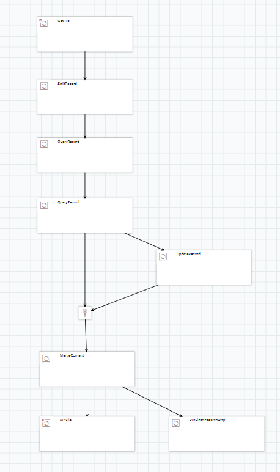
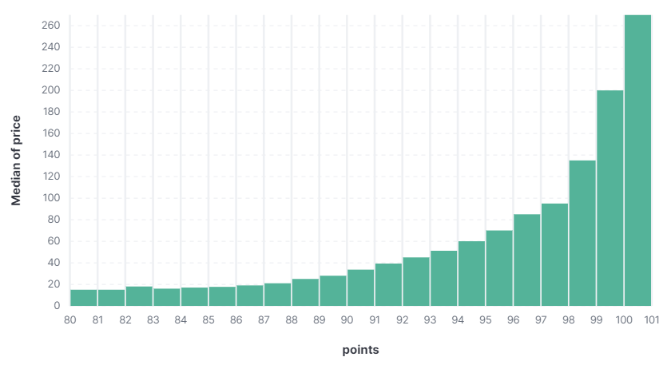
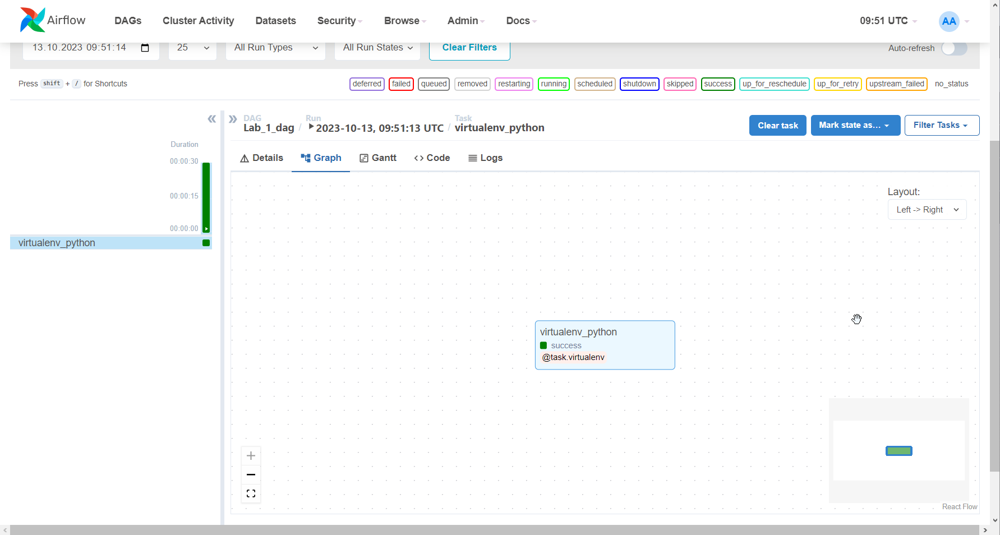

# Отчет по лабораторной работе

## Реализация пайплайна в Nifi

Первоначально пайплайн был реализован с помощью Apache Nifi так как мне показалось, что это более простой в освоении инструмент, и это дейстивтельно так. Графический интерфейс позволяет очень просто и удобно взаимодействовать с данными и производить множество операций, немного времени потребовалось чтобы привыкнуть к названиям процессов указанных в документации, но в целом пользуясь [данным](https://github.com/ssau-data-engineering/Prerequisites/wiki/Apache-NiFi) туториалом и оффициальной [документацией](https://nifi.apache.org/docs.html#) не составило больших проблем построить данный пайплайн

Пользуясь результатами этого же пайплайна была построена визуалиция в Kibana

Здесь изображена гистограмма распределения цены к очкам оценки напитка, зеленым отображены цены до 50, синим от 50 до 100 и красным выше 100.

Здесь изображена зависимость медианы цены напитка к его очкам оценки.

## Реализация пайплайна в Airflow

Для реализации пайплайна в Airflow потребовалось чуть больше времени, в основном потому что, пришлось чуть вникнкуть в описательный синтаксис с помощью которого определяются DAG и его элементы, первоначально пайплайн предполагалось построить из PythonOperator, но после был обнаружен весьма примечальный PythonVirtualenvOperator который позволил выполнить все блоки кода разом не заморачиваясь с определением каждого отдельно, что я нашел весьма удобной функцией, таким образом итоговый код пайплайна реализован полностью внутри оператора виртуального окружения код DAG приведен в [файле](./lab_1_dag.py). Внутри Airflow сам граф выглядит, конечно, весьма просто:

# Лабораторная работа №1

## Базовый пайплайн работы с данными

В рамках данной лабораторной работы предлагается построить простейший пайплайн, собирающий воедино данные из нескольких файлов, обрабатывающий их и сохраняющий результат в no-sql базу данных.

Для построения такого пайплайна воспользуемся следующими инструментами:

* Apache Airflow
* Apache NiFi
* ElasticSearch
* Kibana

В качествен данных - будем использовать набор из нескольких CSV файлов, полученных из набора данных [wine-review](https://www.kaggle.com/datasets/zynicide/wine-reviews/)

CSV файлы с данными можно найти в папке `data` данного репозитория.

## Подготовка к выполнению задания

Для выполнения лабораторной работы рекоммендуется воспользоваться докер контейнерами из подготовительного репозитория: <https://github.com/ssau-data-engineering/Prerequisites/tree/main>

## Задание на лабораторную работу

Схема описывающая пайплайн, который необходимо построить в рамках лабораторной работы:

Данный пайплайн должен быть построен ***дважды***: один раз с использованием **Apache Nifi** и второй раз с использованием **Apache Airflow**.

Также средствами `Kibana` построить гистограмму стоимости напитка к баллам поставленными дегустаторами.

## Сдача лабораторной работы

Для успешной сдачи лабораторной работы итоговый репозиторий должен содержать следующее:

1. Отчет описывающий этапы выполнения работы (скриншоты, описание встреченных проблем и их решения приветствуются) 
в формате .pdf или .md
2. Для **Apache Nifi** в репозитории должен быть приложен `.xml` файл, содержащий разработанный пайплайн. (для генерации такого файла, необходимо создать template и экспортировать его через меню `Templates` расположенное в выпадающем списке в правом верхнем углу)
3. Для **Apache Airflow** должны быть приложен программный код реализующий DAG
4. Открыт Pull Request в настоящий репозиторий

## FAQ

### FAQ Apache Nifi

1. CSV файлы необходимо перенести в папку, к оторой **NiFi** имеет доступ (например в папку `nifi/data/lab_1/input`), или можно модифицировать `docker-compose` для проброса папки.
2. Для реализации пайплайна достаточно следующих процессоров:
    * GetFile
    * SplitRecord
    * [QueryRecord](http://localhost:18080/nifi-docs/documentation?select=org.apache.nifi.processors.standard.QueryRecord&group=org.apache.nifi&artifact=nifi-standard-nar&version=1.23.2)
    * [UpdateRecord](http://localhost:18080/nifi-docs/documentation?select=org.apache.nifi.processors.standard.UpdateRecord&group=org.apache.nifi&artifact=nifi-standard-nar&version=1.23.2)
    * MergeContent
    * PutFile
    * PutElasticsearchHttp
3. Регулярное выражение для выбора csv файлов из папки: `[^\.].*\.csv`
4. Свойства `Include Zero Record FlowFiles` у процессоров `QueryRecord` рекомендуется устанавливать в значение `false`.
5. `http://elasticsearch-kibana:9200` - адрес ElasticSearch
6. Для объединения очередей можно использовать `Funnel`

### FAQ Apache Airflow

1. Для работы с CSV данными рекомендуется использовать библиотеку `pandas`
