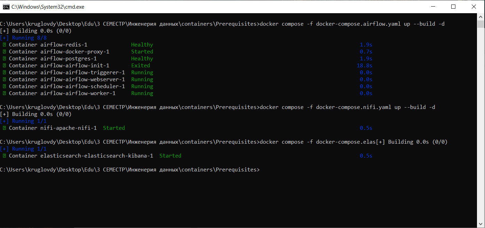
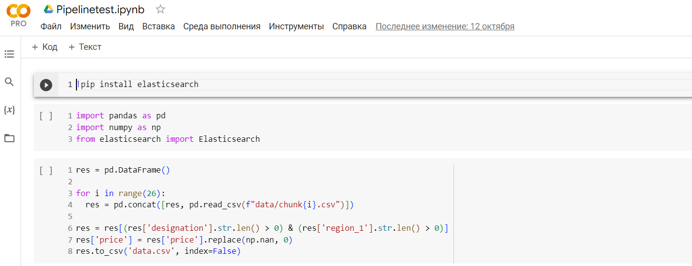
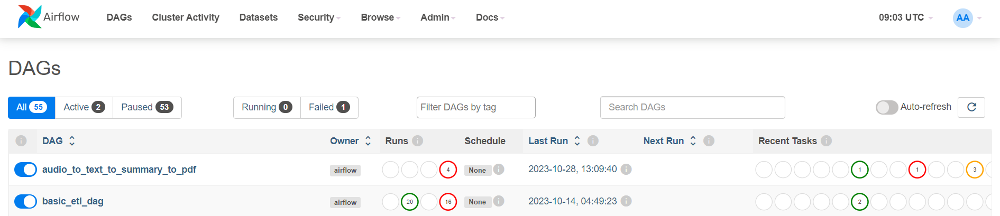
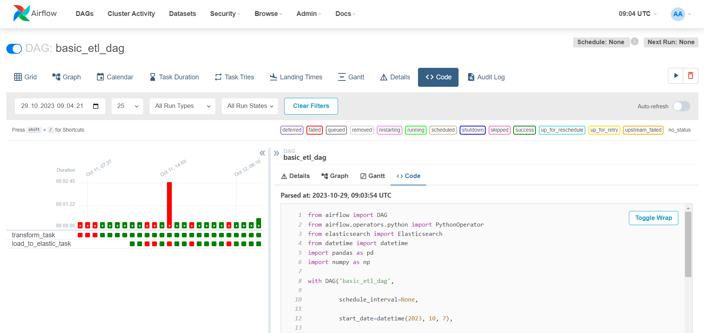
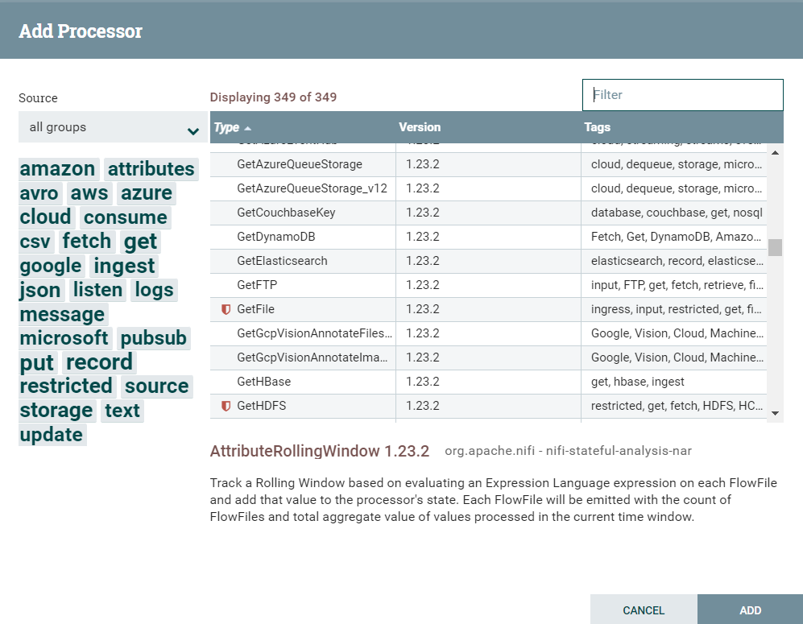
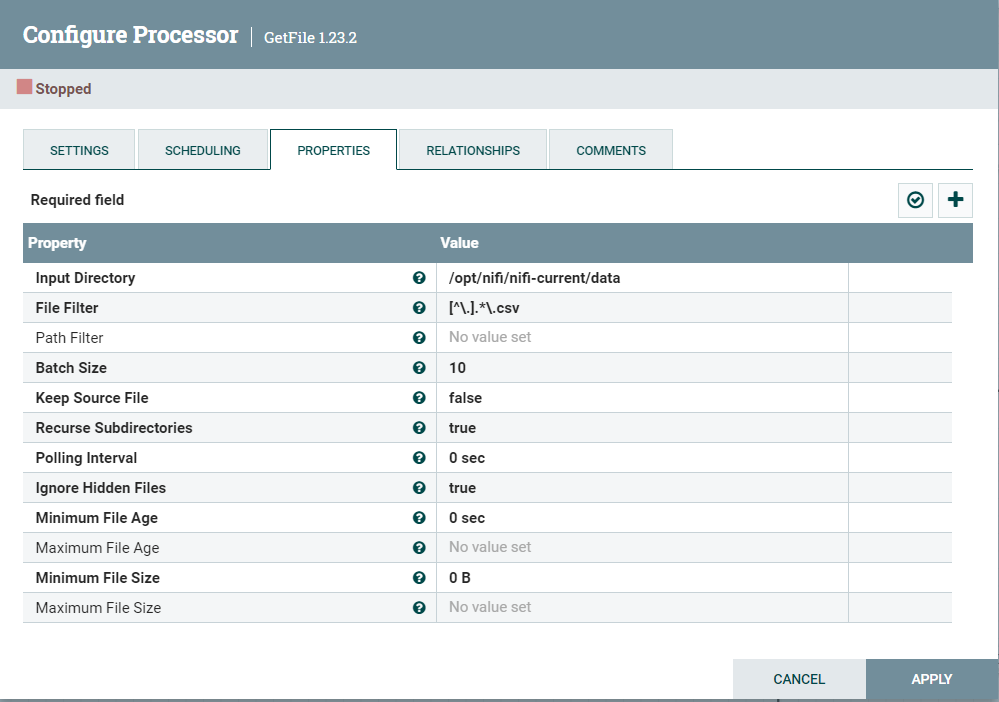
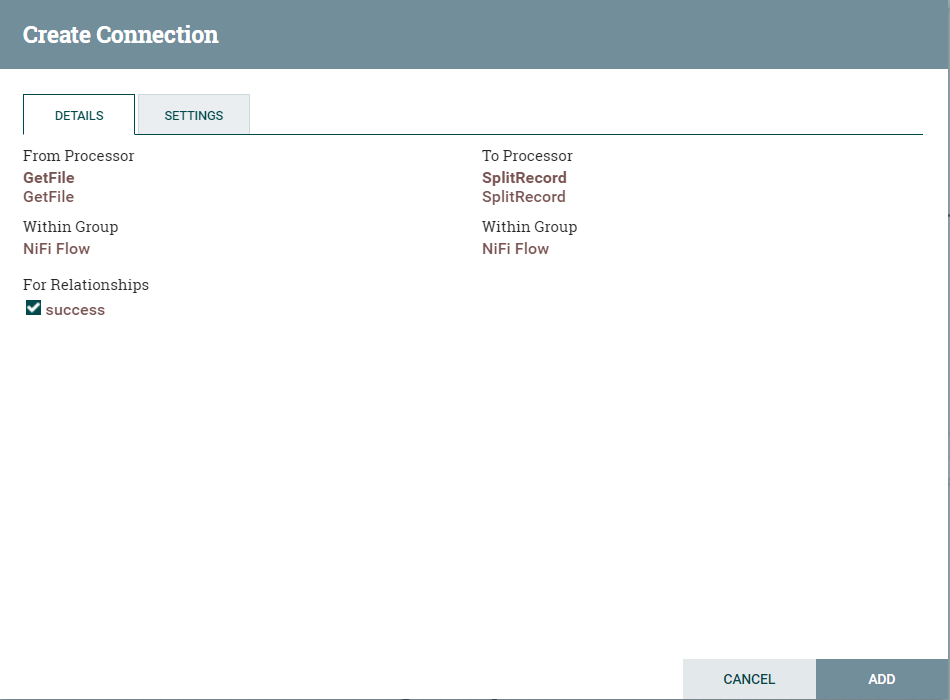
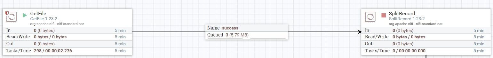

# Отчет по лабораторной работе №1

## Задание на лабораторную работу:
Целю лабораторной работы является знакомство с наиболее популярными инструментами постороения pipeline для сбора и обработки данных, а именно - Apache Airflow и Apache NiFi, в ходе работы будет реализован алгоритм собирающий данные из csv фалов, преобращовывающий значения строк по определенным признакам и отправляющий итоговые данные в nosql базу данных Elasict.
Все требуемое окружение развернуто в контейнерах docker.

## Ход выполнения лабораторной работы

### Установка и запуск окружения 

Нам понядобятся следующие инструменты - 
1. Apache Airflow
2. Apache NiFi
3. Elasticsearch

Для их установки воспользуемся репозиторием - https://github.com/ssau-data-engineering/Prerequisites.git
Клонируем его на локальную машину, выполним подготовительные команды и запустим при помощи команд docker compose. (предварительно запустив Docker Desktop for Windows)
Выглядеть это будет следующим образом - 

Пользовательский интерфейс данных приложений доступен через браузер.

### Apache Airflow

Данный инструмент оперирует с так называемыми DAG (Directed Acyclic Graph), котрые содержат в себе операторы выполняющие конкретные дейстивия с данными и запускаемые в определенной последовательности, сами DAG работают в соответствии с графиком запусков и также могут быть запущенны непостредственно из UI.

В соответствии с заданием нам нужно сформировать DAG, который будет изначально читать данные из определенной директории, делать некоторые преобразования данных и далее отправлять все в nosql хранилище, развернутое в отдельном контейнере, по средством http соединения. Разделим данные задачи на две части.

* Чтение данных и преобразование
Скачаем wine dataset состоящий из 25 файлов по ссылке - https://github.com/ssau-data-engineering/Lab-1/tree/main/data
Нам необходимо прочитать все файлы и отобрать строки с заполненными designation и region_1, установить значение price там где оно не заполнено в 0 и сохранить в единый файл. Код ниже написан в colab с целью упрощения тестирования:

Для использования данного кода в DAG Apachi Air Flow воспользуемся оператором - Pyhon operator:
`    transform_task = PythonOperator(

         task_id='transform_task',

         python_callable=transform_data,

         dag=dag)`

**task_id* тут указывает на идентификатор задания, а **python_callable* указывает на функцию, код который мы хотим выполнить.

* Отправка в elastic search
Для отправки в Elastic мы также используем Pyhon operator, так же нам понадобится библиотека **elasticsearch*:
`es = Elasticsearch("http://elasticsearch-kibana:9200")
     input = pd.read_csv(f"/opt/airflow/data/data.csv")

     for i, row in input.iterrows():
        doc = {
        "country": row["country"],
        "description": row["description"],
        "designation": row["designation"],
        "points": row["points"],
        "price": row["price"],
        "province": row["province"],
        "region_1": row["region_1"],
        "region_2": row["region_1"],
        "taster_name": row["taster_name"],
        "taster_twitter_handle": row["taster_twitter_handle"],
        "title": row["title"],
        "variety": row["variety"],
        "winery": row["winery"],
     }

     if i < input.shape[0] - 1: 
        es.index(index="wines", id=i, document=doc)`

Адрес указанный в качестве URL тут не соответствует localhost, а берется из compose файла образа контейнера.

* Объеденим все вместе. 
Далее необходимо объеденить все в единый DAG, и указать порядок выполнения операторов `transform_task >> load_to_elastic_task`.
Сам файл DAG нужно разместить в папке, которая подключена к соответствующему контейнеру (Apachi AirFlow) в качестве volume - Prerequisites\airflow\dags.
Данные следует размещать в папке - Prerequisites\airflow\data.
После этого мы можем увидеть данный DAG в пользовательском интерфейсе, запустив его также можно укидеть резултат работы:

**Список:*

**Результат:*

Файл с полным кодом DAG можно найти в указанной директории - airflow-csv-node.py

### Apache NiFi

Подход используемый в в данном данном инструменте отличается тем что он ореинтирован на графическое представление операторов в качестве так называемых процессоров, выполняющих те или иные функции над входными данными. Для реализации описанных действий с данными нам понадобятся следующие процессоры:

1. GetFile - чтение файла/файлов в соответсвии с указанной маской
2. SplitRecord - разбиение потока данных
3. QueryRecord - выполнение условных или других запросов над данными
4. UpdateRecord - обновление полей данных
5. MergeContent - объедтинение
6. PutFile - сохранение данных в файл
7. PutElasticsearchHttp - экспорт данных в Elastic Search

* Добавление первого процессора
Для начала в качестве примера добавим процессор, произведем настройку его параметро и сделаем тестовый запуск. Добавить процессор можно зажав иконку "Processor" в верхнем меню пользовательского интерфейса Apachi NiFi и перетащив ее в работчую область, при этом мы увидем следующее:

В меню справа мы видим все доступные процессоры, слева же мы можем применить фильтры по функционалу чтобы сузить список. 
Выберем GetFile и кликнем на нем два раза, при этом откроется окно конфигурации, перейдем во вкладку "Properties".

Тут нам нужно указать параметры **Input directory* и **File Filter*, первый мы берем в соответсвии с той директорией на которую производится маппинг внешнего volume (compose file), второй же соответсвует регулярному выражению для csv файлов.

* Создание связи
Теперь аналогично описанным выше образом добавим Split Processor и создадим связь между ними - для этого необходимо нажать на значек стрелка в центре процессора и зажав его указать на тот процессор с которым необходимо создать связь, при этом появиться окно "Create Connection" как это показано на картинке ниже:

В появившемся окне необходимо нажать на кнопку "Add".

* Запуск процессора
Следующим шагом мы можем запустить нашь процессор (это можно сделать также единажды), предварительно добавив файлы датасета wine в директорию - Prerequisites\nifi\data.
Для этого нажмем правой кнопкой на процессор и выберем "Run".
После запуска мы увидим следующи реультат:

Это означает что файлы прочитаны и поставлены в очереь пока не будет запущен следующий процессор. Мы также можем посмотреть детали очереди нажав на ней правой кнопкой и выбрав "List queue".

* Соберем остальную часть схемы в соответствии с логикой алгоритма.
Стоит отметить некоторые датали:
1. Процессоры SplitRecord, UpdateRecord и QueryRecord содержат обязательные параметры - Record Reader и Record Writer в качестве которых можно выбрать стандартные CSVReader и CSVRecordSetWriter указав в конфигурации свойство Enabled.
2. Для отбора записей по определенным критериям создадим Custom Property процессора QueryRecord - **Correct* и зададим для него следующее значение: SELECT * FROM FLOWFILE WHERE designation <> '' AND region_1 <> ''.  При этом мы получим новую связь процессора, которую и нужно соединять с последующим процессором.
3. Связи появляющиеся например в условных операторах не отменяют уже имеющтиеся типы как например - failure или original, которые можно поставить в значение terminate или retry по Вашему усмотрению.
4. Обновление цены можно сделать как более простым способом - выбрать все записи у которых price == null и в процессоре UpdateRecord добавить пользовательское свойство **/price* со значением 0.0, которое будет устанавливать значение price в 0, или же сделать это установив свойство "Replacement Value Strategy" в значение Replacement Value Strategy и написав условный оператор (на языке NiFi expression language), в данной работе выбран первый вариант.

Итоговая схема выглядт следующим образом:

