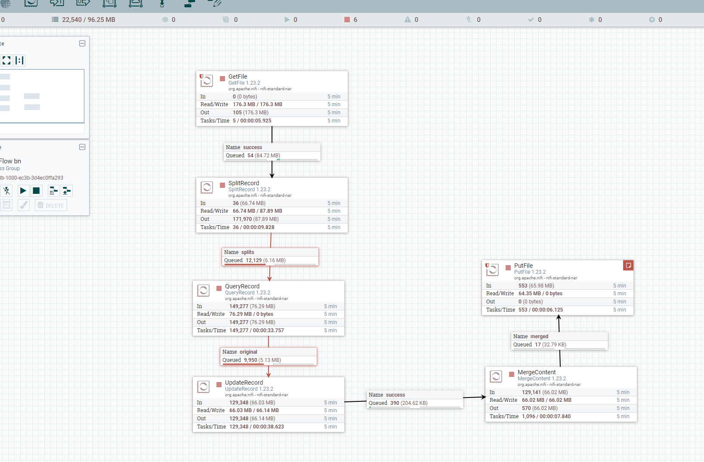

# Лабораторная работа №1
### Выполнил студент 6231-010402D Непряхин Богдан Олегович

## Подключение к Docker

- Скопирован Репозиторицй с GIT Prerequisites 
- Используя compose файлы развернуты airflow, nifi и Kibana-Elasticsearch для накопления и визуализации данных

* Перед тем как начать работу рекомендуется установить докер и wsl на тот диск где будет минимум 20+- свободных GB иначе места может не хватать для выплнения работы

## Работа с **Apache Airflow**

- В качествен данных - будем использовать набор из нескольких CSV файлов, полученных из набора данных [wine-review](https://www.kaggle.com/datasets/zynicide/wine-reviews/)
CSV файлы с набором данных [wine-review](https://www.kaggle.com/datasets/zynicide/wine-reviews/) в папке`data` переместили в папку с airflow, чтобы был коннект с исходными данными.
- Написали DAG с тасками для выполнения процедуры ETL [air_csv](./result_airflow/air_csv.py)
- Запущен DAG и началось выполнение загрузки данных со сбором единого файла

- После того как файл собран, данные из него построчно отправлены в Elasticsearch в json формате
- Данные доступны в БД

- Проиндексировали все значения и создали запись в Index manager

- В Kibana визуализирволали полученные данные

## Работа с **Apache Nifi**

Предварительно тот же датасет со всеми данным перемещаем в папку с Nifi `nifi/data/lab_1/input` и запускаем Nifi  <http://localhost:18080/nifi>
- Создаем первый процессор и добавляем функция GetFile
 прописываем настройки в Properties и задаем каталог где расположены файлы 

- Добавляем новый процессор со SplitRecord и перетаскивая стрелочку на него от GetFile чтобы добавить связь. В настройках подключения выбираем succes и далее в splite добавляем настойки для него уже

* После добавления процессора SplitRecord в нем важно указать ReadCSV и WriteCSV коннектор. Для этого переходим в control_service 

И активируем эти контроллеры

- Далее создаем процессор со QueryRecord куда указываем данные для забота данных в формате SQL. Его соединяем со SplitRecord и передаем в связи значения полученные в split. Прописываем настройки для QueryRecord^

- Следующим добавляем  процессор с UpdateRecord и убираем в поле price `.0` заменяя на 0 значения в поле чтобы привести это поле к числовому формату

- Далее соединяем все файлы в один файл на этапе MergeContent и прописываем настройки объединенния

- Объединенные файлы пишем на диск используя PutFile и параллельно отправляем данные в Elasticsearch

### На данном этапе возникла ошибка в ходе выполнения работы, тк merge по какой то непонятной причине не соединяет файлы воедино. Причну найти не получилось.

Общая схема проектам в **Apache Nifi**

Ссылка на [xml файл](./bn_templ.xml) с данным схемыApache Nifi