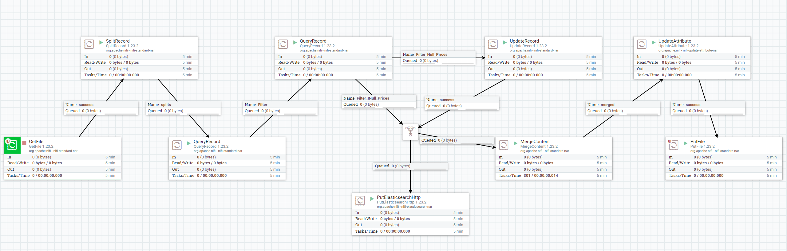
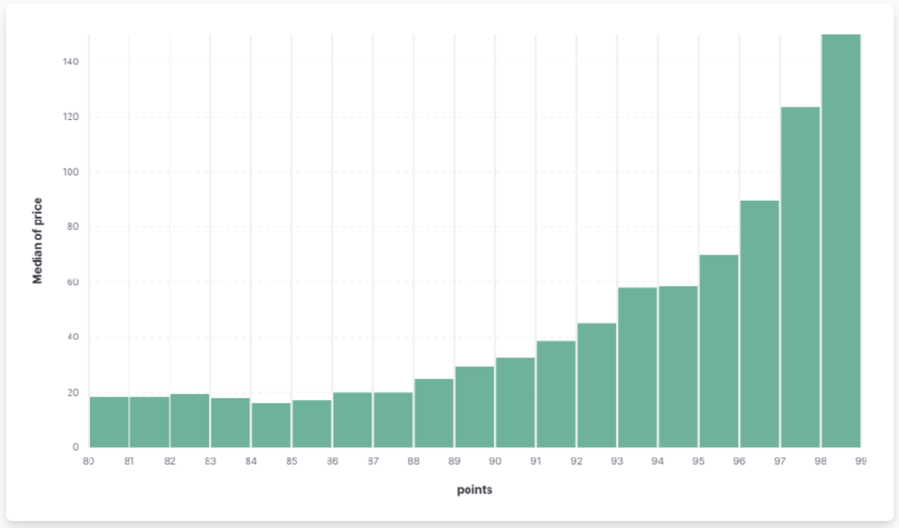

# Лабораторная работа №1 (Кашапов А.И., гр. 6231)

## Знакомство с Nifi

В рамках подготовительных шагов перед выполнением работы, была подготовлена среды разработки и развернуты необхоимые Docker контейнеры, рекомендованные в описании к лабораторной работе (<https://github.com/ssau-data-engineering/Prerequisites/tree/main>).
Также, данные для лабораторной работы были нужные директории, указанные в docker-compose.

Также в работе возникли некоторые трудности, которые были решены незначитальным обновлением Docker-compose для Nifi.



Конфигурация представленной схемы была выгружена как шаблон `lr1_nifi_kashapov.xml`.

## Знакомство с Airflow

Основная задача заключается в создании DAG файла - инструкции с описанием последовательности операций над данными для Airflow.

Разработанный DAG:

```
_PATH = '/opt/airflow/data'

def get_df():
    df = pd.DataFrame()
    for ind in range(26):
        df = pd.concat([df, pd.read_csv(_PATH + f'/input/chunk{ind}.csv')])
    return df

def filter_df():
    df = get_df()
    df = df[(df['designation'].str.len() > 0)]
    df = df[(df['region_1'].str.len() > 0)]
    df['price'] = df['price'].replace(np.nan, 0)
    df = df.drop(['id'], axis=1)
    df.to_csv(_PATH + '/temp/df.csv', index=False)

def upload_df():
    es = Elasticsearch('http://elasticsearch-kibana:9200')
    df = pd.read_csv(_PATH + '/temp/df.csv')

    for ind, data in df.iterrows():
        document = data.to_dict()
        if ind < df.shape[0] - 1:
            es.index(index="wines-data", id=ind, body=document)

with DAG(
    dag_id='lr1-dag',
    schedule_interval=None,
    catchup=False,
    start_date=datetime(2023, 12, 1)
) as dag:
    _filter = PythonOperator(
        task_id='filtering_task',
        python_callable=filter_df,
        dag=dag)

    _upload = PythonOperator(
        task_id='uploading_task',
        python_callable=upload_df,
        dag=dag)

    _filter >> _upload
```

## Визуализация данных

Важной частью работы является знакомство с `Kibana`, где необходимо построить визацлизацию данных.

